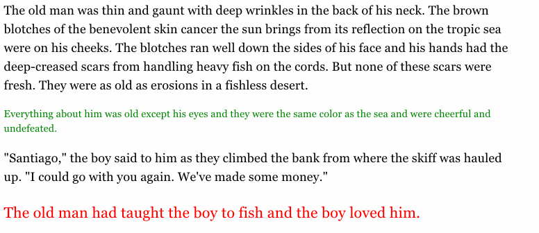

# Paragraph icons for Annotator.js

This is a port of the paragraph icons from the
[Factlink annotation library](https://github.com/Factlink/js-library)
to [Annotator.js](https://github.com/openannotation/annotator).
The goal is to provide a discoverable annotation interface that integrates
automatically with any website. Just drop in the script, and it works!

See [index.html](http://factlink.github.io/annotator-paragraph-icons/) for a demonstration.

### Example



## Usage
Download or clone this repo, and put this in your HTML:
```html
<link rel="stylesheet" type="text/css" href="annotator-paragraph-icons/dist/main.min.css"></link>
<script src="annotator-paragraph-icons/dist/main.min.js"></script>
```

Include as a module in Annotator 2.0: `app.include(window.paragraphUi);`.
This will then add a new hook called `createFromParagraph` which is called when
clicking on a paragraph icon, and passes a reference to the DOM node of the
paragraph.

## Features
- Automatic detection of paragraphs with actual content (no side bars, menus, etc).
- Adapts size and colour of the icons to the text.
- Avoids clashing with styles and scripts of the host page.
- Smooth fading in/out experience when moving the mouse across the document.
- Should work reliably across browsers.
- Fast -- optimised distinct descendants algorithm and batch rendering of icons.

## TODO
- No complete separation of scripts from host page yet. Ideally both the paragraph
  icons and Annotator.js itself would be loaded in a
  [jail iframe](https://github.com/Factlink/js-library/blob/825adb0548af92fc21d6f22b2deb9ec768a4a3f2/app/js/loader/loader_common.coffee)
  to further isolate scripts.
- Refreshing when page content changes (contact me if you need this, I'd be happy
  to spend some time implementing this -- @JanPaul123).

## Development
```bash
npm install
grunt
```

## License
Copyright (c) 2011-2015 Factlink Inc. and individual contributors.
Licensed under MIT license, see [LICENSE.txt](LICENSE.txt) for the full license.
